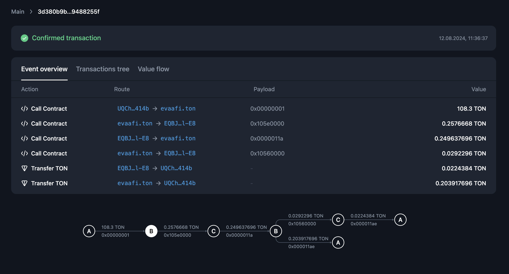
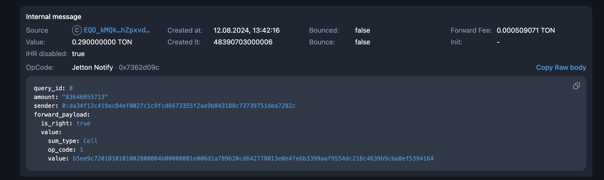

## 基本原理

和 evaa master contract 交互主要有三个行为，存钱，取钱，清算。
存钱 op 为 0x1
取钱 op 为 0x2
清算 op 为 0x3
所以如果我们想实时监控 evaa user contract 的状态主要关注这三个 op 即可，如果有新的 tx 提交，我们就根据 user contract address 去更新他的借贷信息。

根据观察，其实 master contract 的交易不是很频繁，没啥太大压力。

## supply

### supply ton

详情可以看 https://tonviewer.com/transaction/892a51e2d51ed45a41446e5fd17ede0dd453398c06d0fbd40c7084df237ee720

比如 A 用户发起一次存钱，master 会先收到一次 0x1 的消息。
第二次会收到 0x11a 的消息（因为目前 evaa 官方并没有公开合约代码，所以我们是没法解开 ox11a 的消息数据）。
暂时认为所有 ton 存钱都是成功。

### supply jetton

https://tonviewer.com/transaction/2a629ca9c0f7f53dfab81b8b542f3b052a172abdb4510893b8e0f7013089eca6

master 会收到 Jetton Notify · 0x7362d09c 消息，我们可以通过解码该消息

sender字段就是 A 节点的地址，
amount 就是 存款金额
消息体的 source 的地址，master 合约的对应的 jetton wallet 地址，这个是固定的可以确认到底是什么资产。

第二次会收到 0x11a 的消息（因为目前 evaa 官方并没有公开合约代码，所以我们是没法解开 ox11a 的消息数据）。
暂时认为所有 jetton 存钱都是成功。

## withdraw

### withdraw ton

https://tonviewer.com/transaction/fd5844dffe7155821efb68ce06c66ece8158626193036840efe3a139c54d31c4

第一次会收到 0x2 的消息，可以得到提款金额相关信息
如果提款成功会收到 0x211 提取资产的消息，根据 out msg 中，目的地和金额，找到关联的提款交易，更改提款状态。

### withdraw jetton

https://tonviewer.com/transaction/6c9de441603c169d158ba4b4dc6cf30b6bbf111e60eaee0d8c7c77886a3fcd93

第一次会收到 0x2 的消息，可以得到提款金额相关信息
如果提款成功会收到 0x211 提取资产的消息，根据 out msg 中，Jetton Transfer · 0x0f8a7ea5 解析消息体中目的地和金额，找到关联的提款交易，更改提款状态。
